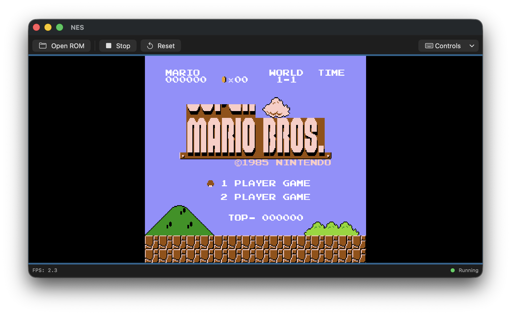
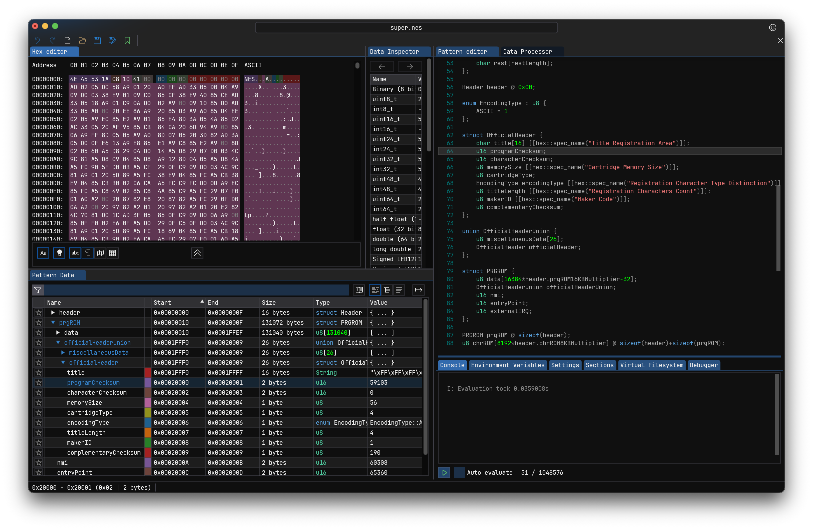

# SwiftNES

打造自己的 NES 游戏模拟器

## 截图

 已实现的核心组件：

  1. CPU.swift - 完整的 6502 处理器实现
    - 所有基本指令（LDA, STA, ADC, JMP等）
    - 所有寻址模式
    - 标志位处理
    - 栈操作
  2. PPU.swift - 图形处理单元
    - 背景渲染
    - 精灵（Sprite）渲染
    - NES 调色板
    - VBlank 和 NMI 处理
    - 256x240 分辨率输出
  3. Memory.swift - 内存管理系统
    - 2KB 内部 RAM（镜像）
    - PPU 寄存器映射
    - 控制器输入
    - 卡带地址空间
  4. Cartridge.swift - 卡带系统
    - .nes 文件格式解析
    - 支持多种 Mapper（NROM, MMC1, UxROM）
    - CHR-ROM/RAM 支持
    - 镜像模式处理
  5. Controller.swift - 控制器输入
    - 8 个按钮支持（A, B, Select, Start, 方向键）
  6. NES.swift - 主模拟器类
    - CPU/PPU 协调
    - 60 FPS 时序
    - NMI 处理
    - FPS 监控
  7. EmulatorView.swift - SwiftUI 显示视图
    - 实时帧缓冲显示
    - 键盘输入映射
    - FPS 显示
  8. ContentView.swift - 主界面
    - ROM 文件加载
    - 启动/停止/重置控制
    - 控制说明

  使用方法：

  键盘控制：
  - 方向键：十字键
  - Z：A 按钮
  - X：B 按钮
  - 回车：Start
  - 空格：Select

  运行步骤：
  1. 在 Xcode 中打开项目
  2. 点击 "Open ROM" 按钮加载 .nes ROM 文件
  3. 模拟器会自动开始运行
  4. 使用键盘控制游戏

  这是一个功能完整的 NES 模拟器，支持大多数常见的 NES 游戏！
